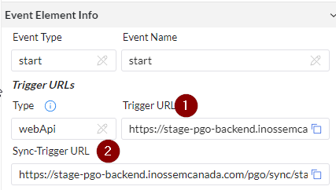

# Start Node

The types of start nodes can be divided into:
+ ***WebAPI:*** An API interface for external systems to call the PGO process.
+ ***GCP File Monitor:*** Google Cloud Platform file monitoring, used for real-time monitoring and processing of files from external systems.
+ ***Timer:*** A scheduled task for periodic execution.
+ ***File Monitor & MQ Monitor:*** For future development of the PCE version.


## WebAPI
The API interface function is used to publish a RESTful API, supporting both synchronous and asynchronous processes. After startup, the system will provide two URLs for accessing synchronous and asynchronous processes.



***

Asynchronous Start URL (Figure 1):
1. Users need to log in to the backend URL to obtain a Token (for specific login information, please consult a PGO representative).

2. After obtaining the Token, place it in the Header (Step 1).

3. Insert the Trigger URL into the URL field and change the start mode to POST (Step 2).

4. Place the data in the Body and send it.


5. After sending, you will receive a start receipt indicating success (200) or failure (500) as shown below:

&emsp; The data section contains PGO's custom return information:

```
{
    "data": {
        "businessKey": "64150b2d-0d70-4682-8aed-d128c08d2ed2",
        "keyword": "businessKey"
    },
    "status": "OK",
    "code": 200,
    "msg": "success"
}
```


***

Synchronous Start URL (Figure 2):

1. Users need to log in to the backend URL to obtain a Token (for specific login information, please consult a PGO representative).

2. After obtaining the Token, place it in the Header.

3. Insert the Sync-Trigger URL into the URL field and change the start mode to POST.

4. Place the data in the Body and send it.

5. The process will not stop until the entire flow is completed, receiving the return information.

 > [!tip] The return information in data can be edited according to the specific requirements of the customer:

```
{
    "data": {
        "Status": "Fail",
        "Message": "Reference Document PurchNoC is already exist"
    },
    "status": "OK",
    "code": 200,
    "msg": "success"
}
```
***

## GCP File Monitor

The file monitoring function is used for real-time monitoring and processing of files in a specified directory.


Required Configuration Items:

+ ***File Path:*** Select the file path to be monitored, which can be configured and bound using a visual button.


+ ***File Pattern:*** Set the filename format of the monitored files to effectively avoid monitoring junk files, etc.

***

## Timer

The timer function is used for periodically executing tasks or programs.


Required Configuration Items:

 > [!note] ***Schedule:*** Use Cron Job syntax in the scheduled execution configuration item (Schedule).


