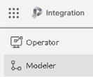
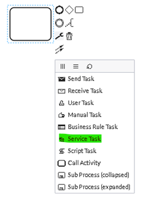
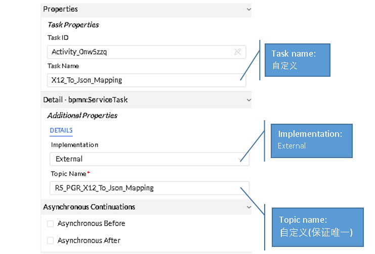
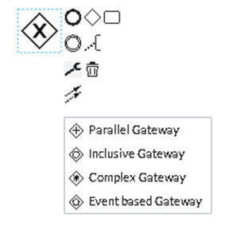
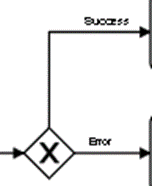
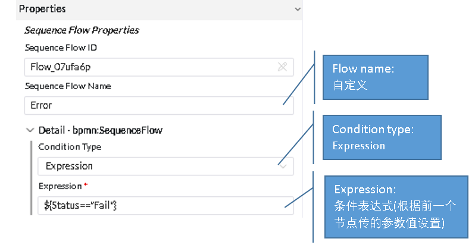

# Creation and Update of Processes

BPMN Process Knowledge Documentation (Camunda Official Website):
[camunda](https://camunda.com/bpmn/ ':camunda')

## 1.Process Creation
### 1.1、Overview of Process Creation Steps
1、From the PGO main page, select Modeler → New

### 1.2、Node Functions and Attributes
#### Start Node

Each process begins with a StartEvent node

#### Task Node

For each task node, different actions are performed to meet various requirements. Generally, the task type is set as Service Task, unless there are special handling cases, such as splitting or parallel tasks.

Service Task attribute settings.

#### Getway
Handle different business processes based on various conditions, using gateways to manage different business branches.
Depending on business requirements, set different types.
For example, under different conditions, handle each business process separately; the type selection can refer to the Camunda official website.

Gateway attribute settings:

#### End Node

Each process ends with an End Event node.

### 1.3、Creation of Special Process Nodes

### 1.4、Process Download and Upload

## 2.Process Update (Version Management)

