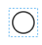

# Creation and Update of Processes

BPMN Process Knowledge Documentation (Camunda Official Website):
[camunda](https://camunda.com/bpmn/ ':camunda')

## 1.Process Creation
### 1.1、Overview of Process Creation Steps
1、From the PGO main page, select Modeler → New

### 1.2、Node Functions and Attributes
#### Start Node

Each process begins with a StartEvent node

#### Task Node

For each task node, different actions are performed to meet various requirements. Generally, the task type is set as Service Task, unless there are special handling cases, such as splitting or parallel tasks.

Service Task attribute settings.

#### Getway
Handle different business processes based on various conditions, using gateways to manage different business branches.
Depending on business requirements, set different types.
For example, under different conditions, handle each business process separately; the type selection can refer to the Camunda official website.

Gateway attribute settings:

#### End Node

Each process ends with an End Event node.

### 1.3、Creation of Special Process Nodes

####Splitting Sub-Processes

When there are multiple business data entries that need to be processed in parallel individually, you can set the Task node type to Call Activity and parallel Multi Instance.

Node Attribute Settings:

Note: After deploying the process, fill in the Element Variable in the Variables section of the first node configuration of the sub-process as follows:

####Automatic Process Retry

When a process may experience delays or access failures after a certain node due to network issues or other non-subjective problems, and the business requires the process to be automatically retried, you can configure a timer node after this node. The node type is as follows:

Attribute configuration:

### 1.4、Process Download and Upload

The process can be exported and downloaded locally:

The process can be uploaded to the target environment via Modeler → BPMN → Import.

## 2.Process Update (Version Management)

