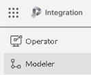
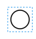

# 流程的创建与更新

BPMN流程知识资料（camunda官网）：
[camunda](https://camunda.com/bpmn/ ':camunda')

## 1.流程创建
### 1.1、流程创建步骤总览
1、PGO主页面选择Modeler -→ New

### 1.2、节点功能及属性
#### 开始节点

每个流程由startEvent节点开始

#### Task节点

#### Getway
#### 结束节点
### 1.3、特殊流程节点创建
### 1.4、流程下载和上传
## 2.流程更新（版本管理）
